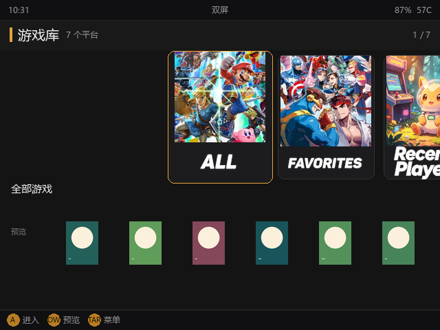
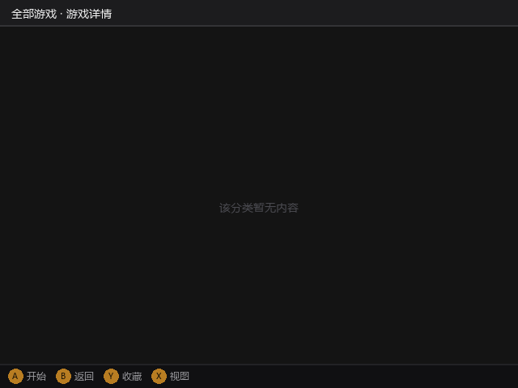
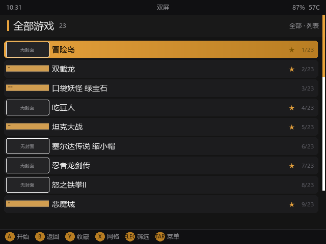
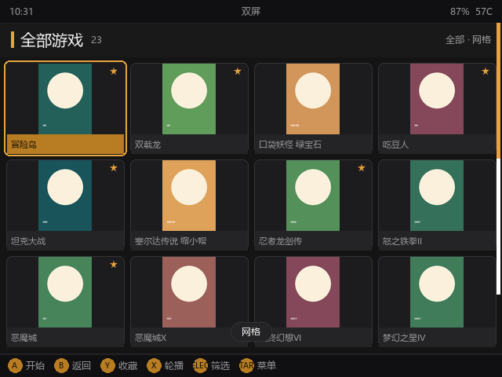
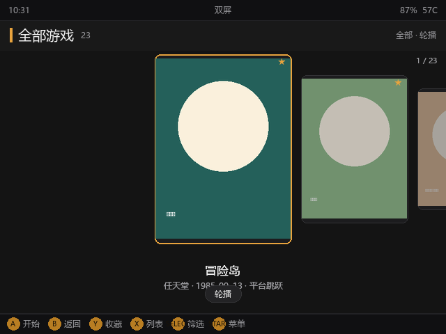
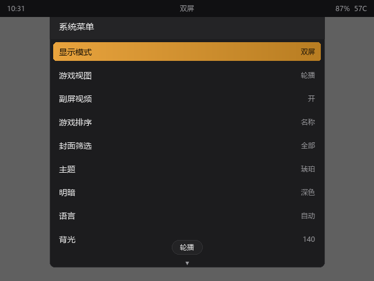
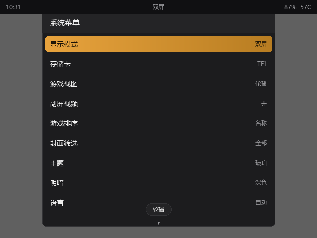
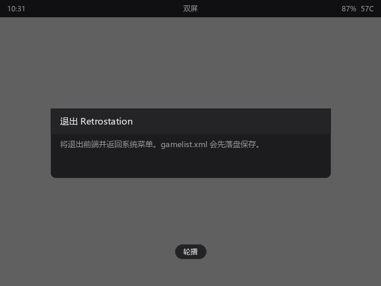

# Retrostation

> 中文 · [English](README.en.md)

Linux 掌机**双屏游戏前端**，兼容单屏。基于 SDL2 + Pillow 渲染栈，适配 Anbernic **RG DS**（Buildroot / Weston / 双 640×480 DSI 屏）。

上屏（DSI-1）交互主控，下屏（DSI-2）上下文联动：显示当前游戏的封面 / 视频与元数据。只检测到 1 个显示输出时自动降级为单屏布局，功能零缺失。

---

## 特性

- **真双屏体验**：上屏游戏列表 / 网格 / 封面轮播，下屏视频优先、缺则封面的媒体联动。
- **游戏页三视图**：列表 / 网格 / 封面轮播，按 `X` 键循环切换。
- **两套元数据格式**：**ES-DE `gamelist.xml`（读 + 写）** 与 **Pegasus `metadata.pegasus.txt`（只读）**，按优先级合并，下屏标注当前条目实际来自哪个文件。
- **ES-DE 媒体布局**：封面 · 视频 · Logo · 截图 · 背景图，目录名与 ES-DE 一致（`covers/`、`videos/`、`marquees/`、`screenshots/`、`fanart/`）。既支持 ES-DE 的独立目录树（`gamelists/` + `downloaded_media/`），也支持放在 ROM 目录内（`<SYS>/gamelist.xml` + `<SYS>/media/`）——**两者内部目录名相同，互相搬家不用改文件名**。
- **互通的游玩状态**：收藏 / 游玩次数 / 上次游玩写回 `gamelist.xml`，与 ES-DE / Batocera 互通。
- **隐藏不想看的游戏**：选中按 `H`（桌面端）或菜单「隐藏此游戏」，条目立即从列表消失。隐藏状态同样写回 `gamelist.xml` 与其他前端互通；菜单「显示隐藏」可随时找回，找回的条目带「隐藏」标记。
- **数据源可插拔**：`data/sources/` 插件层，新增格式只加一个文件，UI 与扫描器不动。
- **副屏视频带声音**：ffmpeg 管道软件解码，音轨经 ALSA 同步播放，**机身音量键**可直接调（±5，即时生效）；无视频 / 解码失败自动回退封面；实测约 4.5% 单核。
- **冷启动快、常驻轻**：索引缓存 + 缩略图缓存，冷启动到首帧约 1.2 s，常驻内存约 40 MB。
- **设置即时落盘**：主题 / 明暗 / 语言 / 背光 / 状态栏改完即写，无需重启。
- **缩略图缓存可控**：设置菜单里可一键开关（关掉则实时缩放，不写卡），或**清空图片缓存**释放卡空间；后台扫描会顺带清掉失效条目。
- **跨平台预留**：只有 `platform/` 允许平台代码，尺寸全走 theme token，为后续 Android App 做准备。

---

## 界面预览

实机界面（无头渲染，上屏 / 下屏并排）：

**首页（轮播卡片）**




**游戏列表 / 网格 / 轮播**

| 列表 | 网格 | 轮播 |
|---|---|---|
|  |  |  |

**设置菜单 / 多卡切换 / 退出**





> 以上截图由 `scripts/screenshot.py --fake` 在本机无头渲染生成，覆盖双屏 640×480。

---

## 架构

三层清晰隔离，保证跨平台与可测试性：

- **平台抽象（`platform/`）**：UI 只能通过 `Canvas` 绘制、通过语义化 `InputAction` 收输入；`data/` 只向平台要路径与目录列表。Linux 实现是 SDL2 + PIL + evdev；未来 Android 复用同一接口（Chaquopy / MediaPlayer）。
- **数据层（`data/`）**：扫描、索引、媒体缓存、数据源插件。扫描结果落 `index.json`，启动即满屏。
- **UI 层（`ui/`）**：状态机 + Painter + 各屏幕模块，所有尺寸走 `theme` token，不硬编码像素。
- **双屏方案**：单进程双画布，上屏驱动、下屏联动；`screen_mode` 为 `single` 时折叠为单画布（详情条沉到列表下方）。

### 项目结构

```
Retrostation/
├── README.md
├── README.en.md                 # 本文英文版
├── retrostation.sh              # 启动器（崩溃保护 + 日志轮转）
├── pyproject.toml
├── docs/
│   ├── DESIGN.md                # 详细设计（架构 / 双屏 / 渲染管线 / 数据源插件 / 跨平台预留）
│   ├── PROTOTYPE.md             # UI 原型说明
│   └── USAGE.md                 # 玩家向：配置、换核心、平台艺术自定义
├── packaging/APPS/              # 部署到设备 APPS 根目录的文件
├── scripts/                     # 部署 / 远程 / 截图 / 自检脚本
├── src/retrostation/            # 应用代码
│   ├── core/                    #   config, model, theme, i18n
│   ├── data/                    #   library, scanner, media, sources/{esde,pegasus}
│   │   └── video.py             #     ★ 副屏视频：防抖 / 节流 / 降级
│   ├── launcher/                #   游戏启动（RA / 独立模拟器）
│   ├── platform/                #   平台抽象 + linux/ 实现
│   │   └── linux/video.py       #     ★ ffmpeg 管道解码
│   └── ui/                      #   状态机、painter、screens、widgets
├── systems.example.json         # 机种自定义示例
├── systems.reference.json       # 机种 → 默认核心完整对照表
└── tests/                       # 单元测试（pytest）
```

---

## 快速开始：部署到掌机

### 一键部署

```bash
# 把 <掌机IP> 换成你的掌机地址（例如 192.168.1.50）
python scripts/deploy.py root@<掌机IP>             # 实际部署（走 ssh/scp，需要 key）
python scripts/deploy.py --dry-run root@<掌机IP>   # 仅打印，不动手
python scripts/deploy.py --reset   root@<掌机IP>   # 顺手清掉 /tmp/retrostation_*

# 设备只有密码（出厂 root/root）时加 --password，会自动改用 paramiko
python scripts/deploy.py root@<掌机IP> --password root
# 或：export RETROSTATION_SSH_PASSWORD=root
```

> 需要 `pip install paramiko`（仅密码登录时需要）。Windows 的 `ssh` 无法非交互传密码，
> 密码模式下 `deploy.py` 走 `scripts/remote.py`（paramiko 的 SSH/SFTP）。

部署会推 4 类文件到设备：

| 源 | 目标 | 说明 |
|---|---|---|
| `src/` | `/mnt/mmc/Roms/APPS/Retrostation/src/` | 应用代码 |
| `retrostation.sh` | `/mnt/mmc/Roms/APPS/Retrostation/retrostation.sh` | 启动器（含崩溃保护 + 日志轮转） |
| `packaging/APPS/Retrostation.sh` | **`/mnt/mmc/Roms/APPS/Retrostation.sh`** | APPS 菜单入口（必须在 APPS **根目录**） |
| `packaging/APPS/Imgs/Retrostation.png` | `/mnt/mmc/Roms/APPS/Imgs/Retrostation.png` | APPS 菜单封面 240×180 |

部署完成后，在设备上打开 **APPS** 菜单 → 选择 **Retrostation.sh** 启动。**必须从 APPS 菜单进入**——原厂前端持屏时 SSH 启动会失败。所有输出落在 `/mnt/mmc/Roms/APPS/Retrostation/log.txt`。

### 操作键位

| 键 | 平台页 | 游戏预览页 |
|---|---|---|
| 上下 | 平台页不响应 | 移动选择（列表 ±1，网格按行 ±4；按住连发） |
| 左右 | 切换平台 | 列表 ±10；网格、轮播 ±1 |
| **A** | 进入游戏库 | **启动游戏**（多文件游戏先弹出启动文件选择） |
| **B** | — | 返回平台页 |
| **X** | — | 切换 列表 / 网格 / 轮播 |
| **Y** | — | 收藏 / 取消收藏 |
| **H / Delete** | — | 隐藏 / 取消隐藏（桌面键盘专属；掌机用菜单「隐藏此游戏」） |
| L1 / R1 | — | 上下翻页 |
| L2 / R2 | — | 跳到 首 / 尾 |
| SELECT | — | 切换筛选（全部 / 有封面 / 缺封面） |
| START | 设置菜单 | 设置菜单 |
| FUNC **长按** | 退出确认 | 退出确认 |

> 上下键仅在**游戏预览页**用于切换选择；平台页请用**左右**键切换平台。
> FUNC 键（BTN_TL2）**长按 0.8 秒**退出。L3 / R3 也绑定了同样的动作，避免误以为退不出去。

### 排错与诊断

```bash
cd /mnt/mmc/Roms/APPS/Retrostation
PYTHONPATH=src python3 -m retrostation.main --scan-only      # 库扫描摘要
PYTHONPATH=src python3 -m retrostation.main --check FC       # 某平台元数据/媒体覆盖率
PYTHONPATH=src python3 -X utf8 scripts/screenshot.py /tmp/shots  # 无头渲染各界面

# 按键映射自检
python3 scripts/probe_input.py --check-keymap
python3 scripts/probe_input.py --watch-any --seconds 20      # 动态抓码
python3 scripts/probe_input.py                               # 列出所有输入节点

# 副屏视频自检（需 ffmpeg）
PYTHONPATH=src python3 -X utf8 scripts/video_selftest.py
PYTHONPATH=src python3 -X utf8 scripts/video_selftest.py --make-demo FC
PYTHONPATH=src python3 -X utf8 scripts/video_selftest.py --system FC --ui /tmp/shots
```

### 关键环境变量（设备 APPS 菜单不会带）

| 变量 | 默认 | 说明 |
|---|---|---|
| `PYSDL2_DLL_PATH` | `/usr/lib` | 找 libSDL2-2.0.so.0 |
| `XDG_RUNTIME_DIR` | `/var/run` | weston socket 所在 |
| `WAYLAND_DISPLAY` | `wayland-0` | 多屏识别靠它 |
| `RETROSTATION_ROM_ROOT` | `/mnt/mmc/Roms` | ROM 库根 |
| `RETROSTATION_CONFIG_DIR` | 启动器目录 | 配置/状态写在这里 |
| `RETROSTATION_KILL_OVERLAY` | 0 | 设为 1 会 `pkill` 残留原厂进程 |
| `RETROSTATION_FONT` | 自动 | 自定义字体路径，覆盖默认 source-han-sans-cn |

### 视频 / 声音 / 元数据相关配置（`config.json`）

| 键 | 默认 | 说明 |
|---|---|---|
| `bottom_video` | `true` | 副屏视频总开关；单屏模式强制关闭 |
| `video_size` | `[288, 216]` | ffmpeg 输出尺寸（运行中按副屏媒体框实际尺寸解码） |
| `video_fps` | `15` | 解码/播放帧率 |
| `bottom_refresh_ms` | `90` | 副屏静态内容最小重绘间隔 |
| `video_sound` | `true` | 预览声音开关；`false` 时副屏视频静音 |
| `video_volume` | `70` | 预览音量 0–100，**机身音量键**可直接调（±5） |
| `metadata.esde_root` | `""` | ES-DE 根目录（含 `gamelists/` 与 `downloaded_media/` 的那个文件夹）；留空则读 ROM 目录内的 `gamelist.xml` + `media/` |
| `metadata.sources` | `["esde", "pegasus"]` | 启用的数据源与优先级 |

媒体查找顺序：`gamelist.xml` 里显式写的路径 → 媒体根下的 ES-DE 类型目录（`covers/`、`videos/` …）
→ 旧约定 `Imgs/` · `video/` · `logo/` → 每游戏一个目录的包（`media/<游戏名>/`）。

> 完整目录结构、两种布局示例与音量操作见 [docs/USAGE.md](docs/USAGE.md) 第五、六节。

---

## 本地开发

```bash
python -m pytest                                   # 全部单元测试（无需掌机）
python -X utf8 scripts/screenshot.py --fake         # 无头渲染各界面到 screenshots/（跨平台，无需 SDL）
python -X utf8 scripts/screenshot.py --fake --lang en_US   # 同上，但渲染英文界面到 screenshots/en_US/（用于英文文档）
python scripts/screenshot.py --single               # 单屏布局截图（需 Linux 平台）
python -m retrostation.main --scan-only --headless --rom-root <目录>
```

`scripts/screenshot.py` 用真实帧循环渲染列表 / 网格 / 轮播 / 菜单 / 下屏，是布局回归的快速检查手段。
加 `--fake` 时用纯 PIL 的 `FakePlatform` 渲染（CI / 笔记本 / Windows 均可跑，不依赖 SDL 与掌机输入栈）。

### UI 原型

```bash
cd prototype && python -m http.server 8899
# 浏览器打开 http://127.0.0.1:8899/
```

或用任意静态服务器打开 `prototype/index.html`。键盘映射见 [docs/PROTOTYPE.md](docs/PROTOTYPE.md#3-键盘--手柄映射)。

---

## 构建与发布

### 打发布包（给别人用）

```bash
python scripts/package_release.py          # 产出 dist/Retrostation-<版本>.zip
python scripts/package_release.py --list   # 只看会打进哪些文件
```

包里就是一个 `APPS/` 目录树，解压后整个拷进 TF 卡的 `Roms/APPS/` 即可使用：

```
APPS/
  Retrostation.sh           菜单入口（必须在 APPS 根目录）
  Imgs/Retrostation.png     菜单图标
  Retrostation/
    retrostation.sh         启动器
    src/…                   应用源码
    scripts/…               设备端自检脚本
    README.md  CHANGELOG.md
```

以**源码**形式分发，不编译 `.pyc`：字节码不能跨 Python 小版本，而这几台设备分别是 3.10 和 3.11。打包时会剔除 `__pycache__`、测试、文档与截图，并为两个 `.sh` 显式设置可执行位（解压和拷贝都会丢掉它）。

### 开发时推送到设备

改完 `.py` 后，用 `deploy.py` 一键推送：

```bash
python scripts/deploy.py root@<掌机IP>             # 推源码到设备
python scripts/deploy.py --dry-run root@<掌机IP>   # 只打印，不执行
python scripts/deploy.py --reset   root@<掌机IP>   # 部署前清掉设备 /tmp/retrostation_*
# 设备只有密码（出厂 root/root）时加 --password，自动改用 paramiko
python scripts/deploy.py root@<掌机IP> --password root
```

部署前 `deploy.py` 会自动清除本地的 `__pycache__` 缓存，避免把开发机（如 Python 3.12）编译的 `.pyc` 带上设备、与设备的解释器冲突。

想验证打好的包而不是仓库本身，用 `--source` 指向解压出来的目录：

```bash
python scripts/deploy.py root@<掌机IP> --source /tmp/bundle --variant Retrostation-Release
```

（历史方案 `scripts/build_release.py` 曾把 `.py` 编译成 `.pyc` 再发布，仅混淆、非加密，且字节码不能跨 Python 大版本，已废弃。）

---

## 使用指南

完整说明见 [docs/USAGE.md](docs/USAGE.md)。最常见两件事：

### 换模拟核心

**方法 A（最小改动）** —— 改 SD 卡 `retrostation/config.json`：

```json
{ "core_overrides": { "gba": "vba_next_libretro.so" } }
```

**方法 B（完整自定义）** —— 创建 `retrostation/systems.json`，连名称、扩展名一起改：

```json
{
  "version": 1,
  "systems": [
    {"key": "gba", "label": "GBA", "label_zh": "GBA", "core": "vba_next_libretro.so"},
    {"key": "fc",  "label": "Famicom", "label_zh": "红白机", "core": "nestopia_libretro.so"}
  ]
}
```

> `label` 是通用 / 英文显示名，`label_zh` 是中文显示名。界面按当前语言自动选用，未来要扩日文加 `label_ja` 字段即可。**默认每个机种已配好核心，开箱即用，无需映射。**

### 自定义平台背景图与 Logo（首页轮播卡片）

> **内置素材来源**：App 内置的平台背景图与 Logo 取自 **NeoStation 前端**的主题美术资源
> （原始素材为背景 1024×1024 方形图、Logo 820×330 透明图），经 `scripts/build_platform_art.py`
> 转换为掌机上解码更快的格式后随 App 打包：背景 `256×256` WebP、Logo `256×103` PNG（保留透明通道）。

在 SD 卡 `retrostation/platform-art/` 下放文件，按机种目录名（key）自动匹配，无需任何配置：

```
retrostation/
└── platform-art/
    ├── background/FC.jpg     ← 红白机卡片背景（方形）
    └── logo/FC.png           ← 红白机卡片 Logo（透明 PNG）
```

规则：文件名大小写不敏感（`FC.jpg` 与 `fc.jpg` 等效）；你放的文件**覆盖**内置同 key 艺术图；内置也没有的新平台显示程序生成的占位图（渐变 + 机种名），不会报错。

常用机种默认核心见 [systems.reference.json](systems.reference.json)（完整含备选核心与扩展名）。

---

## 未来计划

主线（Linux 双屏掌机）功能已全面完成。下一步：

| 阶段 | 内容 | 状态 |
|---|---|---|
| E1 | Pegasus 数据源（只读） | ✅ 完成 |
| E2 | 尺寸 token 化 + 布局比例化（Android 前置条件） | 待开始 |
| E3 | `platform/android/`（Chaquopy 宿主） | 待开始 |
| E4 | Android 视频（硬解）+ 启动 Intent | 待开始 |
| — | 更多数据源格式（如 Skraper、手动清单） | 规划中 |
| — | 列表内搜索 / 高级筛选 / 收藏夹视图 | 规划中 |
| — | 语言包扩展（日文 `label_ja` 等，框架已就绪） | 规划中 |

跨平台（Android）是已预留架构方向的延续：只有 `platform/` 允许平台代码，UI 与数据层不感知具体系统。

---

## 文档

| 文档 | 内容 |
|---|---|
| [docs/DESIGN.md](docs/DESIGN.md) | 详细设计：真机环境实测、架构、双屏方案、渲染管线、输入系统、数据层与**数据源插件架构**、启动器、视觉规范、**跨平台/Android 预留**、风险与里程碑 |
| [docs/PROTOTYPE.md](docs/PROTOTYPE.md) | UI 原型说明：页面状态机、键位、布局数值、原型→真机映射 |
| [docs/USAGE.md](docs/USAGE.md) | 玩家向使用与配置：界面一览、配置文件、换核心、**媒体目录结构（ES-DE / Pegasus）**、**预览声音与音量**、平台艺术自定义、默认核心对照、多卡切换 |
| [docs/USAGE.en.md](docs/USAGE.en.md) | 上文的英文版 |

---


## 目标机环境（实测摘要）

| 项 | 值 |
|---|---|
| 设备 / 系统 | `RGds` / Buildroot 2024.02, Linux 6.1.141, aarch64, 4 核 / 3 GB |
| 显示 | `card0-DSI-1` + `card0-DSI-2`，均 640×480；合成器 Weston(DRM) |
| 运行时 | Python 3.11.8 · Pillow 10.2.0 · SDL2 2.0.32（**无 evdev / requests**） |
| 视频解码 | ffmpeg 4.4.4（无硬解）→ SW 解码 288×216@15fps ≈ 4.5% 单核 |
| ROM | `/mnt/mmc/Roms/<SYS>/`；媒体 `<SYS>/media/{covers,screenshots,videos,marquees,fanart}/`；元数据 `gamelist.xml`（ES-DE）/ `metadata.pegasus.txt`（Pegasus） |
| 启动 | `/mnt/mod/ctrl/RA_launch.sh <core.so> <rom>`；NDS/PSP/SATURN/DC 走独立模拟器 |
| 输入 | 手柄 `/dev/input/event4`，触摸 `/dev/input/event1` |

完整清单见 [docs/DESIGN.md §2](docs/DESIGN.md#2-运行环境实测结论设备档案)。
