> [中文](USAGE.md) · English

# Retrostation Usage & Configuration Guide

> For players / firmware tinkerers. This document covers three things: **what the UI looks like**, **where the config files live**, and the most common customization — **how to swap emulator cores**.
>
> Full system → default core mapping is in the repo-root [`../systems.reference.json`](../systems.reference.json).

---

## 1. UI Overview

Retrostation mainly targets **dual-screen handhelds**: the **top screen** shows the game, the **bottom screen** shows the menu and info (on single-screen devices a bottom detail bar replaces the bottom screen — see Section 11). Below are screenshots of every built-in screen.

### Home (carousel)

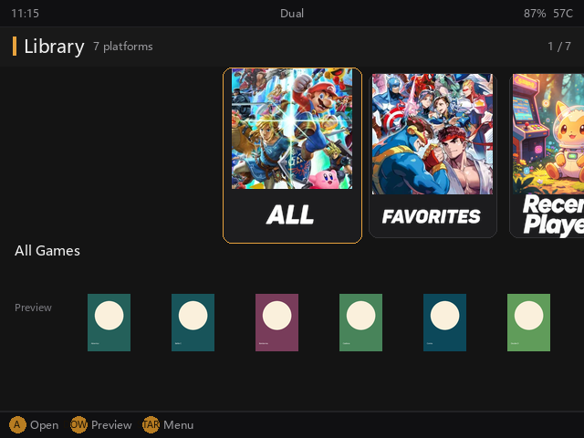
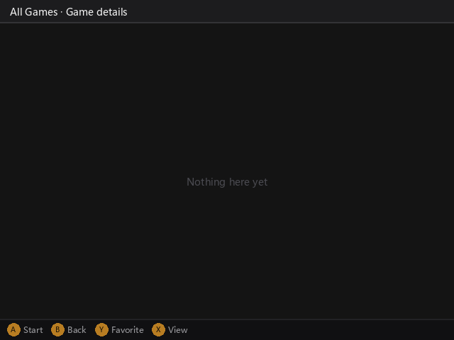

### Game list

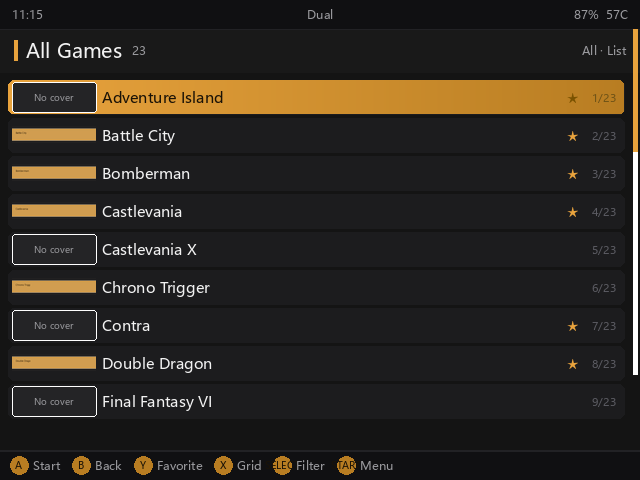


### Grid view

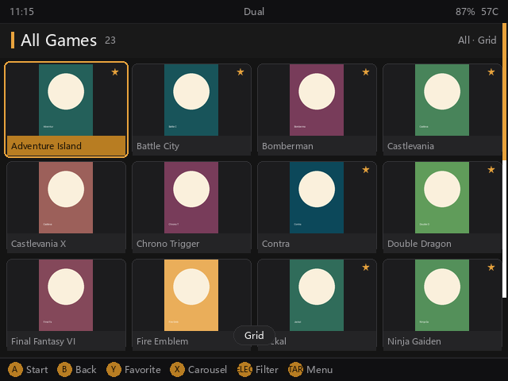

### Carousel view

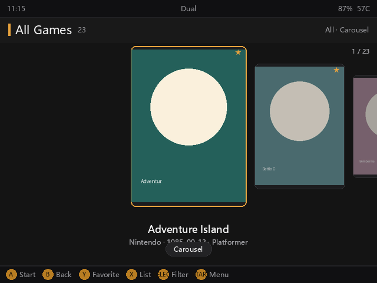

### Settings menu

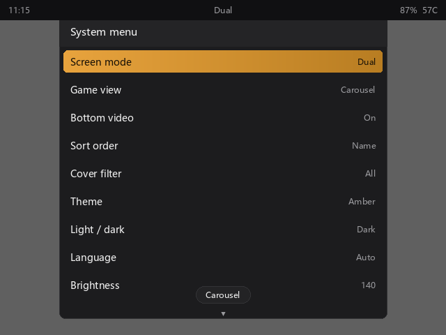
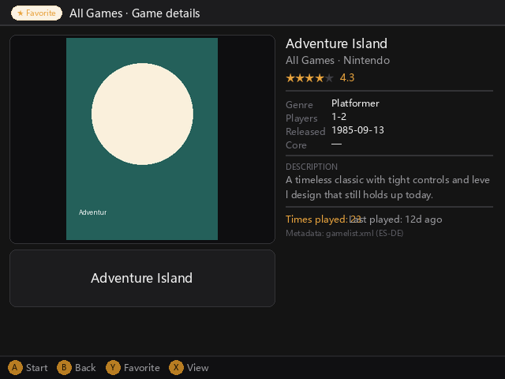

> The screenshots above are from a **single-card** environment. After inserting a second card, the settings menu gains a **"Storage Card"** row for switching the current card and restarting (see Section 9).

### FC system home & list

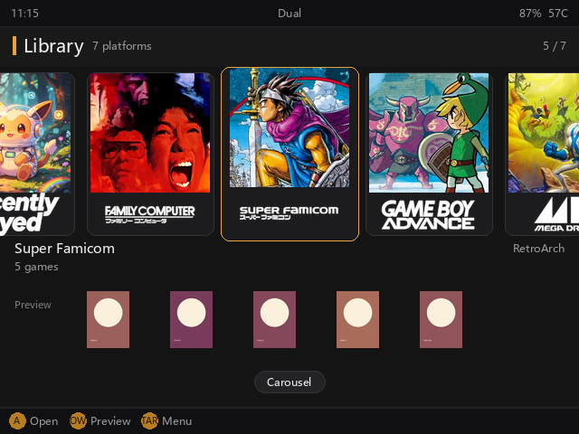
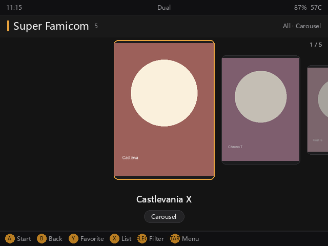

### Exit screen

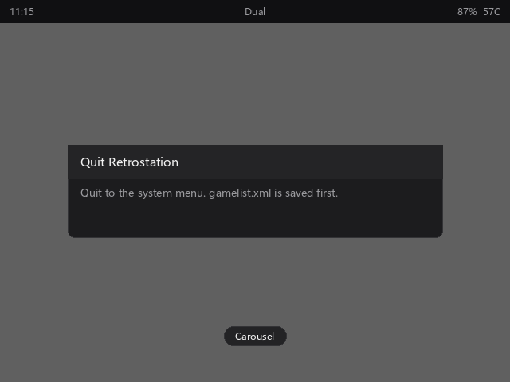

---

## 2. Where Config Files Live

Retrostation's config directory has two layers, **SD card overrides built-in**:

| Location | Path | Source |
|---|---|---|
| **SD card (writable, priority)** | `retrostation/` folder at SD card root | Your manually placed `systems.json` takes effect here |
| **Built-in (read-only)** | `/mnt/vendor/deep/retro/` | Factory default, don't edit directly |

Game ROMs go in the "system directory" under the ROM root, e.g.:

```
/mnt/mmc/Roms/FC/         Famicom games
/mnt/mmc/Roms/GBA/       GBA games
/mnt/sdcard/Roms/SFC/    Super Famicom games on the second card
```

The `system directory` name (e.g. `FC`, `GBA`, `SFC`) is the **key** used later when changing cores.

### Files auto-generated at runtime

After first launch, a `retrostation/` folder appears under the ROM root:

| File | Role | When it appears |
|---|---|---|
| `index.json` | Game index (cover, description, favorites cache) | Generated on first scan |
| `state.json` | Play state (progress, last played game) | Generated on first run |
| `config.json` | User settings (theme, volume, card selection, …) | **Only appears after you change something in the settings menu** |

> Key takeaway: **no core mapping file is generated by default**. `core_overrides` defaults to an empty dict `{}`; every system already has a default core configured internally, works out of the box, no mapping needed. Changing cores is something you do actively — see Section 3.

---

## 3. How to Change Cores (most common)

By default each system uses the core from the built-in table (e.g. GBA uses `mgba_libretro.so`). If you want an alternate core (e.g. GBA → `vba_next_libretro.so`), there are two ways.

### Method A: minimal change — edit `config.json`'s `core_overrides`

For "just swap the core, leave everything else". Add this to SD card `retrostation/config.json`:

```json
{
  "core_overrides": {
    "gba": "vba_next_libretro.so"
  }
}
```

- Key `gba` is the system directory name (see Section 2).
- Value is the core filename (`.so`), must be a real core on the device.

### Method B: full customization — create `systems.json`

For "change name and extensions too". Write to SD card `retrostation/systems.json`:

```json
{
  "version": 1,
  "systems": [
    {"key": "gba", "label": "GBA", "label_zh": "GBA", "core": "vba_next_libretro.so"},
    {"key": "fc",  "label": "Famicom", "label_zh": "红白机", "core": "nestopia_libretro.so"}
  ]
}
```

> `label` is the generic / English display name, `label_zh` is the Chinese display name. The UI auto-selects by current language (Chinese env uses `label_zh`, falls back to `label` if missing, then the directory name). To add Japanese later, add a `label_ja` field — no code change.

`systems.json` **merges** with the built-in table: fields you wrote override built-in values, unwritten ones keep defaults. The repo's [`../systems.example.json`](../systems.example.json) is a fuller example.

### What is the system key?

It's the ROM directory name. Whichever directory you want to swap cores for, use that directory name as the key. Full list is in [`../systems.reference.json`](../systems.reference.json)'s `key` field.

---

## 4. Custom Platform Background & Logo (home carousel cards)

The square background and transparent Logo of the home carousel cards default to the app's built-in packed art, matched by **system directory name (key)**.

> **Where the built-in art comes from**: the shipped platform backgrounds and logos come from the
> **NeoStation frontend**'s theme art (sources: 1024×1024 square backgrounds, 820×330 transparent
> logos). `scripts/build_platform_art.py` converts them into the formats this handheld decodes
> fastest before they are packed into the app: backgrounds as `256×256` WebP, logos as `256×103`
> PNG with alpha. The sources are square, so the card's art box is square too — nothing is cropped.

If you want to give a platform your own image, or give a **newly added platform** a dedicated image, just drop files in the SD card config dir — **auto-matched by folder name (the system directory key), no config needed**:

```
retrostation/
└── platform-art/
    ├── background/
    │   └── FC.jpg        ← Famicom card background (square, fills card)
    └── logo/
        └── FC.png        ← Famicom card Logo (transparent PNG, overlaid on background)
```

Rules:

- Directories: SD card `retrostation/platform-art/background/` for backgrounds, `.../logo/` for Logos.
- Filename: the system directory name (key), **case-insensitive** (`FC.jpg` ≡ `fc.jpg`).
- Formats: background supports `jpg` / `png` / `webp`; Logo supports `png` / `webp` (transparent background recommended).
- Priority: **your files override the built-in same-key art**. Platforms you didn't customize keep the built-in art; new platforms with no built-in art show a program-generated placeholder (gradient + system name), no error.

> Game covers / screenshots are a separate mechanism — see the next section, "Media Directory Layout" — unrelated to this directory.

---

## 5. Media Directory Layout (ES-DE / Pegasus)

Retrostation reads two metadata formats, and the media folders follow **ES-DE**'s naming:

| Source | File | Access |
|---|---|---|
| ES-DE | `gamelist.xml` | **read + write** (favorites / play count / last played are written back to it) |
| Pegasus | `metadata.pegasus.txt` | read-only |

Both can be present at once and are merged with **ES-DE taking priority**: fields ES-DE has come
from ES-DE, and Pegasus fills the gaps. The bottom of the screen names the file the current entry
actually came from, e.g. "Metadata: gamelist.xml (ES-DE)".

### The two places a gamelist can live

**① No ES-DE root (the default)** — metadata sits in the ROM directory, media under `media/`:

```
Roms/
└── PS/
    ├── gamelist.xml                    ← metadata
    ├── GEAR战士电童.chd
    └── media/                          ← media root
        ├── covers/GEAR战士电童.png
        ├── screenshots/GEAR战士电童.png
        ├── videos/GEAR战士电童.mp4
        ├── marquees/GEAR战士电童.png
        └── fanart/GEAR战士电童.jpg
```

**② An ES-DE root is configured** — metadata and media live outside the ROM tree, which is what
ES-DE itself does. Point `metadata.esde_root` in `config.json` at the folder that holds both
`gamelists/` and `downloaded_media/`:

```json
{ "metadata": { "esde_root": "/mnt/mmc/ES-DE" } }
```

```
ES-DE/                                  ← esde_root
├── gamelists/psx/gamelist.xml          ← metadata (ES-DE's own system name)
└── downloaded_media/psx/               ← media root
    ├── covers/GEAR战士电童.png
    ├── videos/GEAR战士电童.mp4
    └── ...
```

The **folder names inside are identical** in both layouts — only the root moves — so a card can be
moved between them without renaming a single file. Leaving `esde_root` empty uses layout ①.

> ES-DE spells systems differently from this frontend; the mapping is automatic
> (`PS` → `psx`, `FC` → `nes`, `SFC` → `snes`, `MD` → `megadrive`, …).

### Media type folders

| Purpose | Folder (aliases) | gamelist element |
|---|---|---|
| Cover | `covers/` (`box2d/`, `2dbox/`) | `<cover>` / `<image>` / `<thumbnail>` |
| Logo | `marquees/` (`wheel/`) | `<marquee>` / `<wheel>` |
| Screenshot | `screenshots/` (`titleshots/`) | `<screenshot>` / `<titleshot>` |
| Video | `videos/` | `<video>` |
| Fanart | `fanart/` | `<fanart>` |

A file is named after the ROM's base name (extension dropped):
`GEAR战士电童.chd` → `covers/GEAR战士电童.png`.

### Lookup order when media is missing

1. The explicit path written in `gamelist.xml` (highest priority)
2. The ES-DE type folders under the media root (in the table's order)
3. The older convention: `Imgs/` (cover), `video/` (video), `logo/` (logo)
4. One-folder-per-game packs: `media/<game>/cover.png` and similar
5. Nothing found → a generated placeholder (gradient tile + system name)

From step 2 on, **each kind looks in its own folders**: the cover folder never answers a logo
lookup, so artwork cannot be matched to the wrong slot.

### Pegasus notes

`metadata.pegasus.txt` is **read-only**: favorites and play counts are not written into it, they go
to `gamelist.xml`. If a card has only Pegasus and no `gamelist.xml`, one is created in that system
directory the first time you favorite something.

The `ignore-files:` directive is honoured too: Pegasus packs use it to mark files to hide (usually
BIOS / device sets, e.g. `neogeo.zip`), and those files never show up as games. One file name per
indented line is supported, and bare `metadata.txt` names are recognised as well.

---

## 6. Preview Sound & Volume

Games that have a video clip play its **soundtrack** along with the picture (on by default).

**Two ways to adjust it:**

- **The device's volume rocker**: ±5 per press; the current value shows on screen and is saved to
  `config.json`. Works on any screen, including inside the settings menu.
- **The settings menu** (press START):
  - **Preview sound** — press A to toggle (off means the bottom-screen clip is silent)
  - **Preview volume** — LEFT / RIGHT for ±5

Changes take effect **immediately**: a clip that is already sounding changes at once, with no
effect on the picture.

The matching `config.json` keys:

| Key | Default | Role |
|---|---|---|
| `video_sound` | `true` | Preview sound master switch; `false` mutes it |
| `video_volume` | `70` | Preview volume 0–100 |

> **Why sound can be a few tens of milliseconds late after switching games**: the sound card can only
> be held by one player process at a time, so Retrostation waits for the outgoing clip to let go of
> it before starting the next one. That is what keeps *every* game audible instead of leaving one
> mysteriously silent. Audio is fully released before a game launches, so the emulator's own sound
> is unaffected.

---

## 7. System → Default Core Mapping (common)

> Full list (with alternate cores `alt_cores`, extensions) is in [`../systems.reference.json`](../systems.reference.json). Below only lists mainstream systems and default cores.

| System dir (key) | Name | Default core |
|---|---|---|
| `FC` | Famicom | `fceumm_libretro.so` |
| `SFC` | Super Famicom | `snes9x2005_plus_libretro.so` |
| `GB` | Game Boy | `gambatte_libretro.so` |
| `GBC` | GB Color | `gambatte_libretro.so` |
| `GBA` | GBA | `mgba_libretro.so` |
| `MD` | Sega Genesis | `picodrive_libretro.so` |
| `SMS` | Sega Master System | `smsplus_libretro.so` |
| `GG` | Game Gear | `gearsystem_libretro.so` |
| `PS` | PlayStation | `pcsx_rearmed_libretro.so` |
| `N64` | Nintendo 64 | `mupen64plus_next_libretro.so` |
| `NDS` | Nintendo DS | Standalone launch (no core) |
| `PCE` | PC Engine | `mednafen_pce_fast_libretro.so` |
| `CPS1` / `CPS2` / `CPS3` | Arcade CPS series | `fbalpha2012_cpsN_libretro.so` |
| `NEOGEO` | Neo Geo | `fbalpha2012_neogeo_libretro.so` |
| `FBneo` | FinalBurn Neo | `fbneo_libretro.so` |
| `MAME` | MAME | `mame2003_plus_libretro.so` |
| `MSX` | MSX | `bluemsx_libretro.so` |

> Systems marked "standalone launch" (NDS, SS, PSP, PICO-8) have no `.so` core and use a dedicated launch script; you can't fill `core`.

---

## 8. Other Configurable Items

`config.json` can also hold these (restart to take effect):

| Key | Role | Example |
|---|---|---|
| `theme` | Theme color | `"dark"` |
| `video_volume` | Preview volume 0–100 (see section 6, "Preview Sound & Volume") | `70` |
| `per_system_sort` | Per-system sort order | `{"FC": "filename"}` |
| `per_system_filter` | Per-system filter | `{"FC": "all"}` |
| `show_hidden` | Show games the player hid (see README "Controls") | `false` |
| `search_by` | Names the search matches: `title` / `rom` / `both` | `"title"` |
| `available_rom_roots` | Manually specify ROM card roots (multi-card) | `["/mnt/mmc/Roms", "/mnt/sdcard/Roms"]` |

---

## 9. Multi-card / Storage Card Switch

When the system detects more than one card (e.g. `TF1` / `TF2`), the settings menu gains a **"Storage Card"** row showing the **label of the current card**:

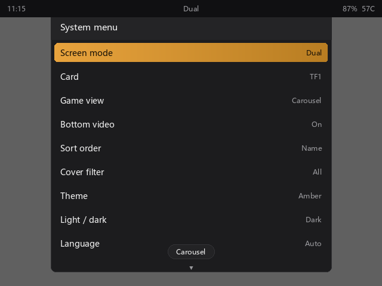

Press **A** to switch between the two cards; this restarts Retrostation and loads the selected card's ROM library. **Each card's library is independent** (separate cache, no mixing of the other card's games). On a single-card setup this row doesn't appear (compare with the settings menu screenshot 05 above).

> You can also use `config.json`'s `available_rom_roots` (see Section 6) to manually specify multiple card roots.

---

## 10. Notes

1. **Core must really exist**: the `.so` in `core` must exist in the device's core directory (default `/mnt/vendor/deep/retro/cores`, fallback `/oem/retro/cores`). A non-existent core shows "no core configured" when launching that game. `ls` that directory before editing.
2. **Restart to take effect**: both `config.json` and `systems.json` are reloaded only after restarting Retrostation.
3. **SD card priority**: config under SD card `retrostation/` overrides built-in defaults.
4. **JSON format**: when hand-editing config, ensure valid JSON (don't drop commas/quotes).

---

## 11. Single-screen Mode

Retrostation is also compatible with **single-screen devices**. The dual-screen split merges onto one screen:

- **Three views** (list / grid / carousel) work as usual, switched with `X`;
- a **bottom detail bar** shows the selected game's name, release/publish, rating and description, replacing the dual-screen bottom context panel;
- settings menu, exit confirm and other overlays are centered on the single screen.

Single-screen mode is auto-detected from the number of connected displays; no manual enable needed.

---

## 12. Interface Language (Chinese / English switch)

The Retrostation UI supports switching between **Chinese / English / Auto** at runtime:

- Open the **Settings menu**: press **START** on the platform page (or game page).
- Find the **Language** row; press **A** to cycle: **Auto → 中文 → English** (instant, no restart).
- **Auto** follows the system default (Chinese on Chinese-locale devices).
- After switching, UI text, system names and descriptions all change; your ROM files and configs are unaffected.

> Tip: system display names come from `systems.json`'s `label` (English/generic) and `label_zh` (Chinese); the UI picks based on current language. To add more languages (e.g. Japanese), add a `label_ja` field — no code change.
