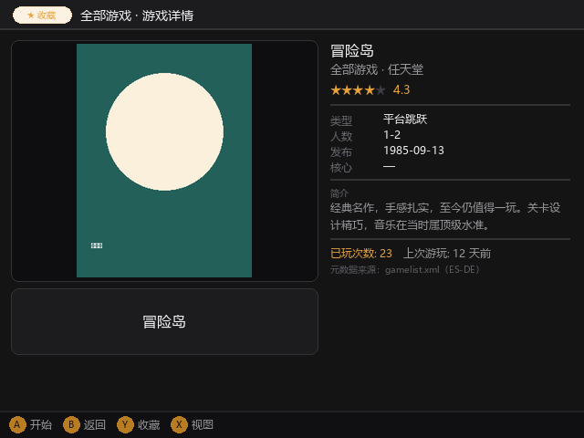
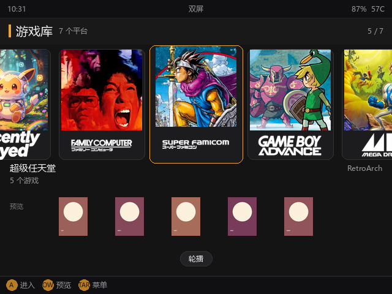
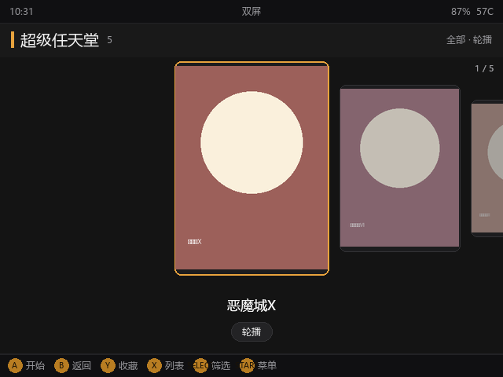

# Retrostation 使用与配置说明

> 中文 · [English](USAGE.en.md)

> 面向玩家 / 折腾固件的人。本文讲三件事：**界面长什么样**、**配置文件在哪**、以及最常见的自定义——**怎么换模拟核心**。
>
> 完整的机种 → 默认核心对照表见仓库根的 [`../systems.reference.json`](../systems.reference.json)。

---

## 一、界面一览

Retrostation 主要面向**双屏掌机**：**上屏**显示游戏画面，**下屏**显示菜单与信息（单屏设备以下方详情条替代下屏，见第九节）。下面是所有内置界面的实机截图。

### 主界面（Carousel 首页）


### 游戏列表


### 网格视图


### 轮播视图


### 设置菜单



> 上图是**单卡**环境。插入第二张卡后，设置菜单会多出一行 **「存储卡」**，用于切换当前卡并重启（见第六节）。

### FC 系统主页与列表



### 退出界面


---

## 二、配置文件在哪里

Retrostation 的配置目录有两层，**SD 卡优先于内置**：

| 位置 | 路径 | 来源 |
|---|---|---|
| **SD 卡（可写，优先）** | SD 卡根目录下的 `retrostation/` 文件夹 | 你手动放的 `systems.json` 会在这里生效 |
| **内置（只读）** | `/mnt/vendor/deep/retro/` | 出厂默认，不要直接改 |

游戏 ROM 放在 ROM 根目录下的「机种目录」里，例如：

```
/mnt/mmc/Roms/FC/        红白机游戏
/mnt/mmc/Roms/GBA/       GBA 游戏
/mnt/sdcard/Roms/SFC/    第二张卡上的超任游戏
```

`机种目录` 的名字（如 `FC`、`GBA`、`SFC`）就是后面改核心时要用到的 **key**。

### 运行时自动生成的文件

第一次启动后，ROM 根目录下的 `retrostation/` 文件夹里会出现：

| 文件 | 作用 | 何时出现 |
|---|---|---|
| `index.json` | 游戏索引（封面、描述、收藏等缓存） | 首次扫描即生成 |
| `state.json` | 游玩状态（进度、最后玩的游戏） | 首次运行即生成 |
| `config.json` | 用户设置（主题、音量、存储卡选择等） | **只有你在设置菜单里改过东西才出现** |

> 关键结论：**默认不会生成任何核心映射文件**。`core_overrides` 默认是空字典 `{}`，每个机种在程序内部已经配好了默认核心，开箱即用，无需映射。换核心是你主动要做的事，详见第三节。

---

## 三、怎么修改核心（最常见问题）

默认情况下每个机种用内置表里写好的核心（例如 GBA 用 `mgba_libretro.so`）。如果你想换成备选核心（比如 GBA 换成 `vba_next_libretro.so`），有两种写法。

### 方法 A：最小改动 —— 改 `config.json` 的 `core_overrides`

适合「只换核心，其他不动」。把下面这段加进 SD 卡 `retrostation/config.json`：

```json
{
  "core_overrides": {
    "gba": "vba_next_libretro.so"
  }
}
```

- 键 `gba` 就是机种目录名（见第二节）。
- 值是核心文件名（`.so`），必须是设备上真实存在的核心。

### 方法 B：完整自定义 —— 创建 `systems.json`

适合「想连名称、扩展名一起改」。在 SD 卡 `retrostation/systems.json` 写：

```json
{
  "version": 1,
  "systems": [
    {"key": "gba", "label": "GBA", "label_zh": "GBA", "core": "vba_next_libretro.so"},
    {"key": "fc",  "label": "Famicom", "label_zh": "红白机", "core": "nestopia_libretro.so"}
  ]
}
```

> `label` 是通用 / 英文显示名，`label_zh` 是中文显示名。界面按当前语言自动选用（中文环境用 `label_zh`，缺失时回退 `label`，都没有则显示目录名）。未来要扩日文，加一个 `label_ja` 字段即可，程序无需改动。

`systems.json` 与内置表**合并**：你写过的字段覆盖内置值，没写的保留默认。仓库里的 [`../systems.example.json`](../systems.example.json) 是更完整的示例。

### 机种 key 是什么？

就是 ROM 目录名。想给哪个目录换核心，就用哪个目录名当键。完整列表见 [`../systems.reference.json`](../systems.reference.json) 的 `key` 字段。

---

## 四、自定义平台背景图与 Logo（首页轮播卡片）

首页轮播卡片的方形背景图和透明 Logo，默认取自 App 内置打包的艺术资源，按**机种目录名（key）**匹配。

如果你想给某个平台换成自己的图，或给**新加的平台**配上专属图，只要在 SD 卡的配置目录下放文件即可——**按文件夹名称（即机种目录名 key）自动匹配，无需任何配置**：

```
retrostation/
└── platform-art/
    ├── background/
    │   └── FC.jpg        ← 红白机卡片背景（方形，铺满卡片）
    └── logo/
        └── FC.png        ← 红白机卡片 Logo（透明 PNG，叠加在背景上）
```

规则：

- 目录：SD 卡 `retrostation/platform-art/background/` 放背景图，`.../logo/` 放 Logo。
- 文件名：就是机种目录名（key），**大小写不敏感**（`FC.jpg` 与 `fc.jpg` 等效）。
- 格式：背景图支持 `jpg` / `png` / `webp`；Logo 支持 `png` / `webp`（建议透明背景）。
- 优先级：**你放的文件覆盖内置同 key 艺术图**。没放的平台仍用内置图；内置也没有的新平台则显示程序生成的占位图（渐变 + 机种名），不会报错。

> 游戏本身的封面 / 截图属于另一套机制（按 ROM 目录下的 `Imgs/`、`logo/` 自动扫描），与此目录无关。

---

## 五、机种 → 默认核心对照表（常用）

> 完整列表（含备选核心 `alt_cores`、扩展名）见 [`../systems.reference.json`](../systems.reference.json)。下表只列主流机种与默认核心。

| 机种目录 (key) | 名称 | 默认核心 |
|---|---|---|
| `FC` | 红白机 | `fceumm_libretro.so` |
| `SFC` | 超级任天堂 | `snes9x2005_plus_libretro.so` |
| `GB` | Game Boy | `gambatte_libretro.so` |
| `GBC` | GB Color | `gambatte_libretro.so` |
| `GBA` | GBA | `mgba_libretro.so` |
| `MD` | 世嘉五代 | `picodrive_libretro.so` |
| `SMS` | 世嘉 Master System | `smsplus_libretro.so` |
| `GG` | Game Gear | `gearsystem_libretro.so` |
| `PS` | PlayStation | `pcsx_rearmed_libretro.so` |
| `N64` | 任天堂 64 | `mupen64plus_next_libretro.so` |
| `NDS` | 任天堂 DS | 独立启动（无 core） |
| `PCE` | PC Engine | `mednafen_pce_fast_libretro.so` |
| `CPS1` / `CPS2` / `CPS3` | 街机 CPS 系列 | `fbalpha2012_cpsN_libretro.so` |
| `NEOGEO` | Neo Geo | `fbalpha2012_neogeo_libretro.so` |
| `FBneo` | FinalBurn Neo | `fbneo_libretro.so` |
| `MAME` | MAME | `mame2003_plus_libretro.so` |
| `MSX` | MSX | `bluemsx_libretro.so` |

> 标注「独立启动」的机种（NDS、SS、PSP、PICO-8）没有 `.so` 核心，走专用启动脚本，不能填 `core`。

---

## 六、其他可配置项

`config.json` 还能写这些（改完重启生效）：

| 键 | 作用 | 示例 |
|---|---|---|
| `theme` | 主题配色 | `"dark"` |
| `volume` | 音量 0–100 | `80` |
| `per_system_sort` | 每个机种各自的排序方式 | `{"FC": "filename"}` |
| `per_system_filter` | 每个机种各自的筛选 | `{"FC": "all"}` |
| `available_rom_roots` | 手动指定 ROM 卡根（多卡时） | `["/mnt/mmc/Roms", "/mnt/sdcard/Roms"]` |

---

## 七、多卡 / 存储卡切换

当系统检测到多于一张卡（如 `TF1` / `TF2`）时，设置菜单会多出 **「存储卡」** 一行，并显示**当前所在卡**的标签：


按 **A** 在两张卡之间切换，会重启 Retrostation 并加载所选卡的 ROM 库。**每张卡的库互相独立**（各自缓存，互不混入对方的游戏）。单卡环境下这一行不会出现（可与上图 05 的设置菜单对照）。

> 也可用 `config.json` 的 `available_rom_roots`（见第六节）手动指定多张卡的根目录。

---

## 八、注意事项

1. **核心必须真实存在**：`core` 里填的 `.so` 必须存在于设备的核心目录（默认 `/mnt/vendor/deep/retro/cores`，回退 `/oem/retro/cores`）。填了不存在的核心，启动该游戏时会提示「no core configured」。改之前去那个目录 `ls` 确认一下。
2. **重启生效**：无论是 `config.json` 还是 `systems.json`，修改后重启 Retrostation 才会重新加载。
3. **SD 卡优先**：SD 卡 `retrostation/` 下的配置会覆盖内置默认值。
4. **JSON 格式**：手改配置文件注意是合法 JSON，逗号、引号别漏。

---

## 九、单屏模式

Retrostation 同时兼容**单屏设备**。双屏的分工会合并到一块屏上：

- **三视图**（列表 / 网格 / 轮播）照常，按 `X` 切换；
- 屏幕**底部一条详情条**显示当前选中游戏的名称、发行 / 出版、评分与简介，替代双屏下屏的上下文面板；
- 设置菜单、退出确认等弹层在单屏上居中显示。

单屏模式由设备实际连接的屏幕数自动判定，无需手动开启。

---

## 十、切换界面语言（中文 / 英文）

Retrostation 的界面支持在**中文 / 英文 / 自动**之间实时切换：

- 打开**设置菜单**：在平台页（或游戏页）按 **START**。
- 找到 **「语言」** 一行，按 **A** 循环切换：**自动 → 中文 → English**（即时生效，无需重启）。
- **自动**跟随系统默认（中文环境下默认中文）。
- 切换后界面文字、机种名、简介都会跟着变；你的 ROM 文件与配置文件不受影响。

> 提示：机种显示名来自 `systems.json` 的 `label`（英文/通用）与 `label_zh`（中文），界面按当前语言自动选用。要新增语言（如日文）加一个 `label_ja` 字段即可，程序无需改动。
